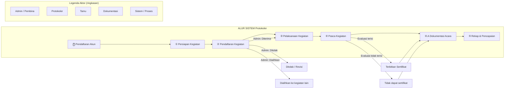
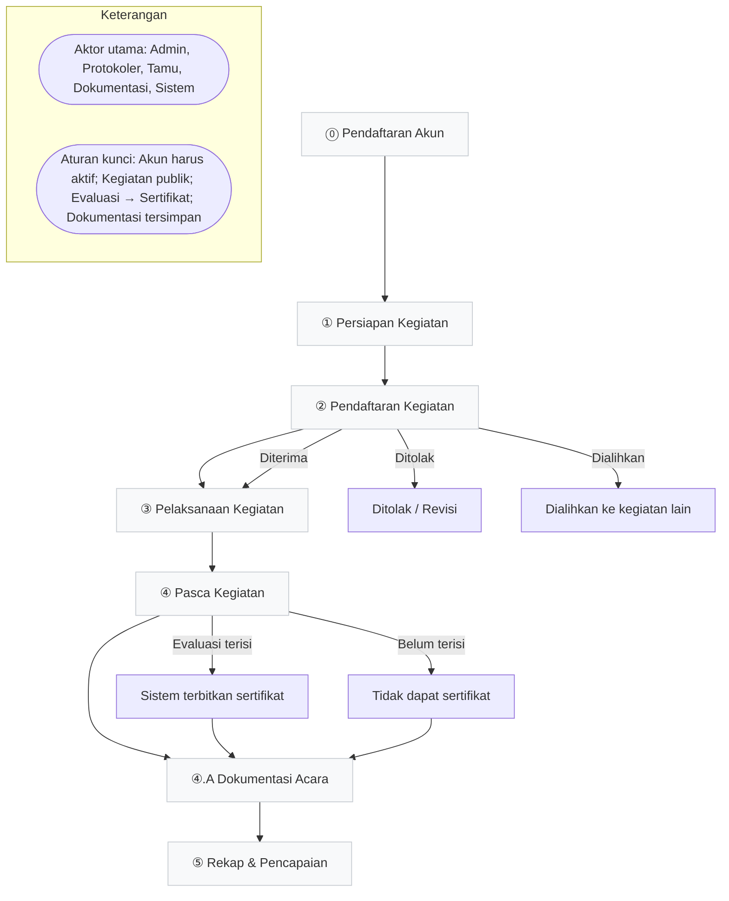

# ALUR SISTEM

## Protokoler – Sistem Informasi Protokoler Universitas

**Versi 1.2 | Juni 2025**

---

| Info              | Detail                                       |
| ----------------- | -------------------------------------------- |
| **Nama Produk**   | Protokoler                                      |
| **Versi**         | 1.2                                          |
| **Dokumen**       | Alur Kerja & Narasi Sistem                   |
| **Role Terlibat** | Admin, Protokoler, Tamu, Dokumentasi, Sistem |

---

## Legenda Aktor

| Simbol | Aktor               | Deskripsi                                                        |
| ------ | ------------------- | ---------------------------------------------------------------- |
| 🟦     | **Admin / Pembina** | Mengelola kegiatan, verifikasi akun, seleksi, evaluasi           |
| 🟩     | **Protokoler**      | Mendaftar, bertugas, absen, mengisi evaluasi                     |
| 🟧     | **Tamu**            | Mengisi testimoni pasca kegiatan                                 |
| 🟪     | **Dokumentasi**     | Upload foto dan video dokumentasi acara setelah kegiatan selesai |
| ⬜     | **Sistem / Proses** | Proses otomatis yang dijalankan sistem                           |

---

## Gambaran Umum Alur Sistem

Bagian ini merangkum alur utama Protokoler dari awal hingga akhir. Intinya, sistem bergerak dari pendaftaran akun, persiapan kegiatan, pendaftaran tugas, pelaksanaan, pasca kegiatan, lalu rekap pencapaian anggota.



### Urutan Inti

| Fase                   | Fokus Proses                                                             | Hasil Utama                                           |
| ---------------------- | ------------------------------------------------------------------------ | ----------------------------------------------------- |
| ⓪ Pendaftaran Akun     | Protokoler mendaftar, unggah foto, lalu diverifikasi admin               | Akun aktif atau revisi data                           |
| ① Persiapan Kegiatan   | Admin membuat kegiatan, mengisi detail, lalu menentukan kebutuhan SDM    | Kegiatan tersimpan sebagai draf atau dipublikasikan   |
| ② Pendaftaran Kegiatan | Protokoler mendaftar ke kegiatan yang publik, lalu direview admin        | Pendaftar diterima, ditolak, atau dialihkan           |
| ③ Pelaksanaan Kegiatan | Protokoler menjalankan tugas dan absen selfie saat kegiatan berlangsung  | Kehadiran tercatat oleh sistem                        |
| ④ Pasca Kegiatan       | Evaluasi protokoler, testimoni tamu, dan feedback admin berjalan paralel | Sertifikat diterbitkan jika evaluasi terisi           |
| ④.A Dokumentasi Acara  | Dokumentasi upload foto dan video acara selesai untuk arsip              | Dokumentasi tersimpan dan dapat diakses via dashboard |
| ⑤ Rekap & Pencapaian   | Sistem memperbarui rekap anggota dan kategori sertifikat                 | Status anggota dan level pencapaian diperbarui        |

### Hubungan Antar Fase

- Pendaftaran akun harus selesai sebelum protokoler dapat mengikuti kegiatan.
- Hanya kegiatan berstatus publik yang dapat diikuti protokoler.
- Pendaftar yang diterima masuk ke tahap pelaksanaan bersama surat tugas yang diterbitkan sistem.
- Sertifikat hanya muncul setelah evaluasi pasca kegiatan terpenuhi.
- Dokumentasi acara (foto dan video) dapat diupload oleh role dokumentasi setelah kegiatan selesai dan dapat diakses via dashboard dokumentasi.
- Dashboard evaluasi menampilkan hasil evaluasi dari admin, protokoler, dan tamu untuk transparansi dan feedback.
- Rekap pencapaian anggota selalu diperbarui setelah siklus kegiatan selesai.

---

## FASE ⓪ — Pendaftaran Akun Protokoler

### Narasi

Sebelum dapat berpartisipasi dalam sistem, setiap calon anggota protokoler wajib mendaftarkan akun terlebih dahulu. Proses ini dimulai dengan pengisian data diri lengkap mencakup nama lengkap, NIM, program studi, departemen, dan fakultas. Calon anggota juga diwajibkan mengunggah dua jenis foto: foto setengah badan dan foto full body sebagai identitas visual dalam sistem.

Setelah data dikirimkan, sistem memproses dan menyimpan informasi tersebut. Admin kemudian melakukan verifikasi kelengkapan dan keabsahan data. Jika ditolak, calon anggota diminta merevisi dan mendaftar ulang. Jika disetujui, akun protokoler dinyatakan aktif.

### Diagram Alur

```
🟩 Protokoler mengisi data diri
   (nama, NIM, prodi, departemen, fakultas)
          │
          ▼
🟩 Upload foto profil
   (foto setengah badan + foto full body)
          │
          ▼
⬜ Sistem memproses & menyimpan data
          │
          ▼
    ┌─────┴─────┐
    ▼           ▼
🟦 Admin verifikasi akun?
    │           │
  DITOLAK    DISETUJUI
    │           │
    ▼           ▼
🟩 Revisi   ⬜ Akun Aktif
   data     (siap digunakan)
    │
    └──→ (kembali ke awal)
```

### Ringkasan Langkah

| Aktor         | Langkah                                                                    |
| ------------- | -------------------------------------------------------------------------- |
| 🟩 Protokoler | Mengisi data diri: nama, NIM, prodi, departemen, fakultas                  |
| 🟩 Protokoler | Mengunggah foto setengah badan dan foto full body                          |
| ⬜ Sistem     | Memproses dan menyimpan data pendaftaran                                   |
| 🟦 Admin      | Verifikasi data → Ditolak (revisi & daftar ulang) / Disetujui (akun aktif) |

---

## FASE ① — Persiapan Kegiatan

### Narasi

Admin selaku pembina membuat kegiatan baru dengan mengisi formulir yang memuat informasi pokok: nama kegiatan, tanggal, tempat, dan jam. Selanjutnya admin mengisi detail kegiatan lebih mendalam: deskripsi peserta (audience), daftar tamu VVIP (internal/eksternal), narasumber utama (keynote), serta rundown acara.

Admin kemudian menentukan kebutuhan SDM: jumlah protokoler dan LO yang dibutuhkan menggunakan dropdown, dengan fitur pencarian nama untuk memilih individu tertentu secara langsung.

Setelah semua data terisi, admin memilih dua opsi: simpan sebagai **Draf** (belum dipublikasikan) atau **Posting Publik** (open registrasi).

### Diagram Alur

```
🟦 Admin membuat kegiatan baru
   (nama, tanggal, tempat, jam, peserta)
          │
          ▼
🟦 Isi detail kegiatan
   (audience, VVIP internal/ext, keynote, rundown)
          │
          ▼
🟦 Tentukan kebutuhan protokoler & LO
   (dropdown jumlah + search nama protokoler)
          │
          ▼
    ┌─────┴──────┐
    ▼            ▼
  DRAF         PUBLIK
(tersimpan)  (open daftar)
```

### Ringkasan Langkah

| Aktor    | Langkah                                                                   |
| -------- | ------------------------------------------------------------------------- |
| 🟦 Admin | Mengisi data kegiatan: nama, tanggal, tempat, jam, peserta                |
| 🟦 Admin | Mengisi detail: audience, VVIP (internal/eksternal), keynote, rundown     |
| 🟦 Admin | Menentukan jumlah protokoler & LO via dropdown + search nama              |
| 🟦 Admin | Simpan sebagai Draf (tidak publik) atau Posting Publik (open pendaftaran) |

---

## FASE ② — Pendaftaran Kegiatan

### Narasi

Setelah kegiatan dipublikasikan, protokoler yang memiliki akun aktif dapat mendaftarkan diri untuk bertugas. Sistem mencatat setiap pendaftaran dan menampilkan daftar calon kepada admin untuk ditinjau.

Admin melakukan seleksi dengan tiga kemungkinan hasil: **diterima**, **ditolak**, atau **dialihkan** ke kegiatan lain. Pendaftar yang **diterima** dilanjutkan ke penugasan tim, sedangkan sistem menerbitkan surat izin kuliah/surat tugas untuk seluruh anggota yang lolos seleksi pada kegiatan tersebut.

### Diagram Alur

```
🟩 Protokoler mendaftarkan diri
   (pada kegiatan yang dipublikasikan)
          │
          ▼
🟦 Admin review pendaftaran
          │
    ┌─────┼──────────┐
    ▼     ▼          ▼
DITERIMA DITOLAK  DIALIHKAN
    │                │
    ▼                ▼
⬜ Sistem menerbitkan    🟩 Dialihkan ke
   surat tugas              kegiatan lain
   (surat izin kuliah
    seluruh tim)
```

### Ringkasan Langkah

| Aktor         | Langkah                                                                     |
| ------------- | --------------------------------------------------------------------------- |
| 🟩 Protokoler | Mendaftarkan diri pada kegiatan yang telah dipublikasikan                   |
| 🟦 Admin      | Meninjau pendaftaran: Diterima / Ditolak / Dialihkan ke kegiatan lain       |
| ⬜ Sistem     | Menerbitkan surat tugas (surat izin kuliah) untuk seluruh tim yang diterima |

---

## Dashboard Dokumentasi & Evaluasi

### Dashboard Dokumentasi Acara

Setelah kegiatan selesai, role **Dokumentasi** dapat mengakses dashboard dengan dua halaman utama:

1. **Halaman List Acara**: Menampilkan daftar semua acara yang telah selesai. Setiap acara menunjukkan nama, tanggal, tempat, dan status dokumentasi.

2. **Halaman Upload Dokumentasi**: Memungkinkan dokumentasi memilih acara selesai untuk upload foto dan video acara. Sistem menyimpan media dengan metadata acara dan tanggal upload.

### Dashboard Evaluasi

Dashboard evaluasi dapat diakses oleh **Admin** dan **Protokoler** yang menampilkan hasil evaluasi lengkap:

- **Hasil Evaluasi Admin**: Feedback dan penilaian admin terhadap kegiatan dan tim protokoler
- **Hasil Evaluasi Protokoler**: Angket evaluasi protokoler terhadap kegiatan
- **Hasil Evaluasi Tamu**: Testimoni dan feedback dari tamu undangan

Informasi ini bersifat transparan dan dapat membantu dalam perbaikan kegiatan mendatang.

---

## FASE ③ — Pelaksanaan Kegiatan

### Narasi

Pada hari pelaksanaan, setiap protokoler yang terdaftar wajib melakukan absensi kehadiran dalam bentuk **selfie** secara langsung saat kegiatan sedang berlangsung. Mekanisme ini memastikan kehadiran fisik dapat terverifikasi secara digital, mengurangi potensi kecurangan, dan menjadi bagian dari rekam jejak aktivitas anggota.

### Diagram Alur

```
⬜ Kegiatan berlangsung
          │
          ▼
🟩 Protokoler absen selfie
   (dilakukan saat kegiatan berlangsung)
          │
          ▼
⬜ Sistem mencatat kehadiran
   (rekam jejak aktivitas anggota)
```

### Ringkasan Langkah

| Aktor         | Langkah                                                                    |
| ------------- | -------------------------------------------------------------------------- |
| 🟩 Protokoler | Melakukan absensi selfie saat kegiatan berlangsung sebagai bukti kehadiran |
| ⬜ Sistem     | Mencatat dan menyimpan rekam jejak kehadiran anggota                       |

---

## FASE ④ — Pasca Kegiatan

### Narasi

Setelah kegiatan selesai, tiga alur berjalan **secara paralel** dari tiga aktor berbeda:

**Protokoler** wajib mengisi angket evaluasi dalam rentang waktu **1×24 jam** sejak kegiatan berakhir, mencakup evaluasi pelaksanaan kegiatan secara keseluruhan dan refleksi diri atas kinerja pribadi.

**Tamu** undangan dapat mengisi form testimoni kapan saja tanpa batasan waktu sebagai umpan balik eksternal.

**Admin/Pembina** dapat memberikan feedback langsung terhadap kegiatan maupun kinerja tim protokoler.

Sertifikat hanya diterbitkan sistem jika evaluasi protokoler **telah terisi dalam batas waktu**. Form testimoni tamu dan feedback admin/pembina tetap menjadi bagian dari proses evaluasi, tetapi tidak mengubah ketentuan utama penerbitan sertifikat.

### Diagram Alur

```
⬜ Kegiatan selesai
          │
    ┌─────┼──────────────────┐
    ▼     ▼                  ▼
🟩 Protokoler     🟧 Tamu          🟦 Admin/Pembina
   isi angket        isi form          beri feedback
   evaluasi          testimoni         evaluasi
   (batas 1×24 jam)  (tanpa batas      kegiatan
                      waktu)
    │
    ▼
⬜ Evaluasi terisi?
    │           │
   YA          BELUM
    │           │
    ▼           ▼
⬜ Sistem     🟩 Tidak dapat
   terbitkan     sertifikat
   sertifikat
```

### Ringkasan Langkah

| Aktor         | Langkah                                                                                |
| ------------- | -------------------------------------------------------------------------------------- |
| 🟩 Protokoler | Mengisi angket evaluasi kegiatan & refleksi diri (batas waktu 1×24 jam)                |
| 🟧 Tamu       | Mengisi form testimoni kegiatan (tanpa batas waktu)                                    |
| 🟦 Admin      | Memberikan feedback evaluasi terhadap kegiatan dan tim protokoler                      |
| ⬜ Sistem     | Menerbitkan sertifikat jika angket terisi; tidak diterbitkan jika melewati batas waktu |

---

## FASE ④.A — Dokumentasi Acara

### Narasi

Setelah kegiatan selesai dan fase evaluasi berjalan, role **Dokumentasi** bertanggung jawab mengumpulkan dan mengunggah dokumentasi visual acara. Dokumentasi dapat melihat daftar semua acara yang telah selesai melalui dashboard khusus dan memilih acara untuk mengunggah foto serta video dokumentasi lengkap.

Setiap upload dokumentasi dilengkapi dengan metadata acara (nama, tanggal, tempat) dan tanggal upload otomatis oleh sistem. Dokumentasi yang telah diupload dapat diakses kembali melalui dashboard dokumentasi untuk arsip dan review, sehingga memudahkan admin dalam membuat laporan atau publikasi acara.

### Diagram Alur

```
⬜ Kegiatan selesai
          │
          ▼
🟪 Dokumentasi lihat daftar acara selesai
   (via dashboard dokumentasi)
          │
          ▼
🟪 Pilih acara & upload foto + video
   (dokumentasi visual acara)
          │
          ▼
⬜ Sistem menyimpan dokumentasi
   (metadata acara + tanggal upload)
          │
          ▼
🟪 Dokumentasi dapat diakses via dashboard
   (untuk arsip dan review)
```

### Ringkasan Langkah

| Aktor          | Langkah                                                                   |
| -------------- | ------------------------------------------------------------------------- |
| 🟪 Dokumentasi | Mengakses dashboard dokumentasi dan melihat list acara yang telah selesai |
| 🟪 Dokumentasi | Memilih acara selesai dan mengunggah foto serta video dokumentasi acara   |
| ⬜ Sistem      | Menyimpan dokumentasi dengan metadata acara dan tanggal upload            |
| 🟪 Dokumentasi | Dapat mengakses kembali dokumentasi via dashboard untuk arsip dan review  |

---

## FASE ⑤ — Rekap & Pencapaian Anggota

### Narasi

Sistem secara otomatis memperbarui rekap data setiap anggota protokoler setelah setiap kegiatan diselesaikan. Rekap mencakup total jumlah kegiatan yang telah diikuti, status keanggotaan, serta koleksi sertifikat yang diperoleh.

Sertifikat dikategorikan ke dalam tiga tingkatan berdasarkan akumulasi jumlah kegiatan sebagai bentuk apresiasi dan motivasi untuk terus aktif berpartisipasi.

### Diagram Alur

```
⬜ Sistem memperbarui akun protokoler
   (jumlah kegiatan, status aktif, koleksi sertifikat)
          │
          ▼
⬜ Kategorisasi sertifikat berdasarkan jumlah kegiatan
          │
    ┌─────┼──────────┐
    ▼     ▼          ▼
  PERAK  SILVER    GOLD
 1–10   11–29    30+ keg.
 kegiatan kegiatan
          │
          ▼
       SELESAI
```

### Tingkatan Sertifikat

| Kategori      | Jumlah Kegiatan  | Keterangan                                                |
| ------------- | ---------------- | --------------------------------------------------------- |
| 🥈 **Perak**  | 1 – 10 kegiatan  | Tingkat awal, anggota baru mulai aktif berpartisipasi     |
| 🥇 **Silver** | 11 – 29 kegiatan | Tingkat menengah, anggota telah menunjukkan konsistensi   |
| 🏆 **Gold**   | 30+ kegiatan     | Tingkat tertinggi, anggota sangat aktif dan berpengalaman |

### Ringkasan Langkah

| Aktor     | Langkah                                                                   |
| --------- | ------------------------------------------------------------------------- |
| ⬜ Sistem | Memperbarui rekap akun: jumlah kegiatan, status aktif, koleksi sertifikat |
| ⬜ Sistem | Mengklasifikasikan sertifikat: Perak (1–10) / Silver (11–29) / Gold (30+) |

---

## Ringkasan Alur End-to-End



---

## Aturan Bisnis Penting

| No  | Aturan                                                                | Dampak                                                            |
| --- | --------------------------------------------------------------------- | ----------------------------------------------------------------- |
| 1   | Akun protokoler hanya aktif setelah diverifikasi admin                | Protokoler tidak bisa daftar kegiatan sebelum akun aktif          |
| 2   | Kegiatan hanya bisa diikuti jika statusnya Publik                     | Kegiatan Draft tidak tampil untuk protokoler                      |
| 3   | Admin bisa menolak atau mengalihkan pendaftar                         | Protokoler yang ditolak tidak masuk tim kegiatan                  |
| 4   | Absensi selfie wajib saat kegiatan berlangsung                        | Kehadiran tanpa selfie tidak tercatat di sistem                   |
| 5   | Angket evaluasi wajib diisi dalam 1×24 jam                            | Melebihi batas waktu = tidak mendapatkan sertifikat               |
| 6   | Sertifikat dikategorikan otomatis oleh sistem                         | Kategori berdasarkan akumulasi jumlah kegiatan                    |
| 7   | Testimoni tamu tidak memiliki batas waktu                             | Bisa diisi kapan saja setelah kegiatan selesai                    |
| 8   | Dokumentasi acara (foto & video) diupload setelah kegiatan selesai    | Dokumentasi tersimpan untuk arsip dan dapat diakses via dashboard |
| 9   | Dashboard evaluasi menampilkan hasil dari admin, protokoler, dan tamu | Transparansi evaluasi untuk feedback dan improvement kegiatan     |
| 10  | Dashboard dokumentasi menampilkan list acara selesai dan upload files | Role dokumentasi dapat manage dokumentasi visual acara            |

---

## Perubahan & Penambahan dari Dokumen Alur (v1.2)

Berdasarkan analisis dokumen alur sistem dan diagram flowchart yang diberikan, berikut fitur-fitur yang **ditambahkan atau diperbarui** dibandingkan versi sebelumnya:

| Fitur Baru / Diperbarui                            | Ditemukan Di   | Keterangan                            |
| -------------------------------------------------- | -------------- | ------------------------------------- |
| Upload foto setengah badan + full body saat daftar | Docx & Diagram | Bagian dari proses pendaftaran akun   |
| Verifikasi akun oleh admin (approve/reject)        | Docx & Diagram | Gatekeeper sebelum akun aktif         |
| Detail kegiatan: VVIP internal/eksternal, keynote  | Docx           | Lebih detail dari versi sebelumnya    |
| Opsi Draf vs Publik saat simpan kegiatan           | Docx & Diagram | Admin bisa draft dulu sebelum publish |
| Seleksi pendaftar: Diterima / Ditolak / Dialihkan  | Docx & Diagram | Tiga opsi seleksi, bukan hanya dua    |
| Surat izin kuliah / surat tugas otomatis           | Docx & Diagram | Diterbitkan sistem setelah seleksi    |
| Absensi selfie saat pelaksanaan                    | Docx & Diagram | Verifikasi kehadiran fisik digital    |
| Angket evaluasi 1×24 jam pasca kegiatan            | Docx & Diagram | Mandatory untuk mendapat sertifikat   |
| Form testimoni tamu (tanpa batas waktu)            | Docx & Diagram | Role Tamu ditambahkan ke sistem       |
| Sertifikat otomatis jika angket terisi             | Docx & Diagram | Conditional: harus isi angket dulu    |
| Tingkatan sertifikat: Perak / Silver / Gold        | Docx & Diagram | Gamifikasi pencapaian anggota         |
| Role Tamu sebagai aktor baru                       | Docx           | Sebelumnya belum ada role ini         |
